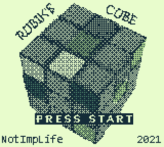
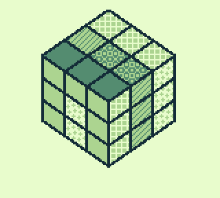
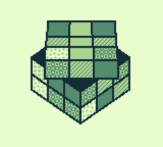
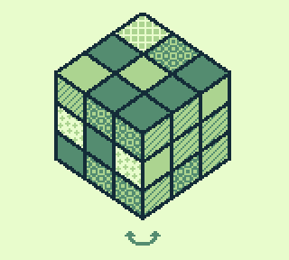
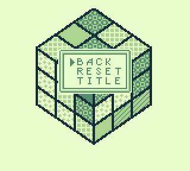

# rubik

_Why Can't I Find An Intuitive Usage For The Tiles?_

This repo is part of [HomebrewOwl.GB](https://github.com/NotImplementedLife/HomebrewOwl.GB "HomebrewOwl") projects collection.
Download the latest version [here](https://github.com/NotImplementedLife/rubik/releases/download/1.3/rubik_1_3.gb).

Uh, well... So, I made a Rubik's cube simulator on Gameboy. _`Cause why not?_ Whoo ```>^•^<```

## The idea

The main purpose of this project was to test a useless tiles fact which once popped into my mind:

</img>_(tile)_ + </img>_(brush)_ + </img> _(mask)_ = </img> _(painted tile)_

_Ok, N•I•L, what's wrong with you?_, says a fellow visitor, probably confused whether the picture above should represent a cat or a mouse. I shamefully admit that pixel art is one of my greatest weaknesses. But that doesn't matter. Just like _why_ in the world should I think this is a good idea to implement as my very second shot on Gameboy programming considerably matters less. I just applied the problem->solution statement, but in reverse order. I found the solution, which was tile painting, had to create a problem. And that's it - a holy unpolished and annoying Rubik's cube simulator. 

For anyone wondering, yeah, it was goddamn exciting.

Except the fact that the Gameboy displays only 4 color and I needed at least 6 for the cube's pieces _(why didn't I try Gameboy Color???)_.

Except the fact that I stuck to the childish wish of creating some kind of three-dimensional perspective on an '80s handheld (which wouldn't really be a burden for the experienced one, but for the guy who amateurishly messes up even the most basic algorithms, it could pose an absolute challenge).

Except the fact that I found myself in a need to write my own random generator, realizing how much I miss the moments when I lazily struggled to avoid adding another `var rand=new Random();` line in my C# projects.

Except the fact that, without the warm-hearted GBDev community and its immeasurable help, I would be as good as dead in this mysterious yet amazing world of Gameboy Assembly.

But, despite any difficulty which showed up during this project, I assertively kept working on it, because, after all, it was extremely fun.

## How to build

```
git clone https://github.com/NotImplementedLife/rubik --recursive
```

```
cd rubik
make
```
Make sure RGBDS is installed and exists in your `%PATH%`.

## How to play

Use `Left`/`Right` to rotate the top layer in the corresponding direction. This is the only layer the player can move. In order to move another layer, the player needs to bring it to the top by rotating the cube. This can be done by pressing `Select`. Some circular arrows will appear. They show the axis around which the cube will be rotated. Press `Select` again in order to reveal other pair of circular arrows. Press `Left`/`Right` to move the cube around the chosen axis. Press `B` to hide the circular arrows and the top layer can be rotated again.

There is a pause menu, which can be displayed by pressing the `Start` button. The options included are:
- `Reset` the cube's configuration;
- get back to the `Title` screen.

No reward for solving the cube currently. Not even a `Well done!` message. This will be probably added in one of the next versions.

There are two game modes :

- Normal : the program shuffles the cube and you have to solve it;
- Freestyle : start from an already solved cube and try to experiment things and learn techniques in your own way.

<b>Game tests are required</b> to assure the mechanics correctitude and reliability (for example, detect and solve a wrong color mapping on cube rotation). Preferably by someone who has a bit of experience with solving this little thing. (Yeah, you got me: I suck at puzzles and strategy games :) ). Help & advice from anyone would be greatly appreciated.


## Screenshots

</img>
</img>

</img>
</img>

</img>

## Linked

- [HomebrewOwl.GB](https://github.com/NotImplementedLife/HomebrewOwl.GB "HomebrewOwl.GB") - check out my other Gameboy projects
- Graphics were made using my [Tileset Generator](https://notimplementedlife.github.io/Gameboy-ASM-Examples/misc/TilesetGenerator/index.html)
